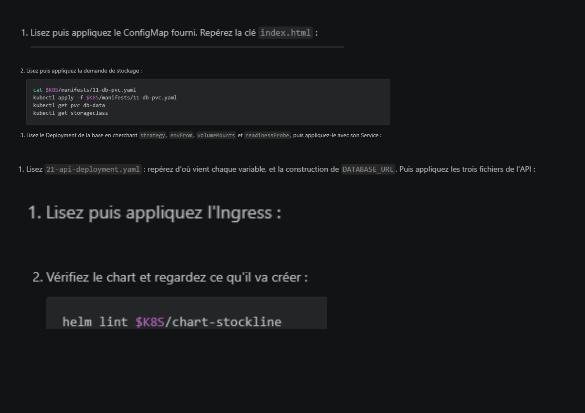

# Réponses aux questions du TP:

## Etape 1:
1. Dans la liste kubectl get pods -A, associez chaque composant à son rôle : kube-apiserver, etcd, kube-scheduler, coredns. Lequel stocke l'état désiré du cluster ?

    - kube-apiserver : point d’entrée central du cluster, reçoit et valide toutes les requêtes API (kubectl, contrôleurs, etc.).
    - etcd : base de données clé/valeur du cluster, elle stocke l’état actuel et la configuration du cluster.
    - kube-scheduler : décide sur quel nœud un pod doit être planifié/exécuté.
    - coredns : service DNS interne du cluster, permet de résoudre les noms des services.

## Etape 2:
1. Le pod n'a pas été recréé car on a pas utilisé de deployment pour faire en sorte qu'il y ait à minima x pods qui soient toujours actifs.

2. La colonne 'READY 1/1' signifie que l'on a demandé la création d'un pod et que celui ci est bien actif
La colonne 'RESTARTS 0' signifie qu'aucun redémarrage du pod n'a été constaté jusqu'à maintenant

## Etape 3:
1. Le pod a été recréé par le ReplicaSet du Deployment. Il compare le nombre de pods réels avec le nombre souhaité via les labels du selector, et recrée le manquant.

2. Le passage à 3 replicas a été annulé parce que kubectl apply -f front-deployment.yaml réécrit l’état déclaré dans le manifest. Donc le cluster est revenu à la config du fichier, pas à l’action impérative. En équipe, il faut toujours garder les manifests comme source de vérité.

## Etape 4:
1. En changeant le selector du Service en app: vitrine les endpoints deviendraient alors vide, et le wget http://front ne fonctionnerai plus.

2. Les pods doivent appeler 'front' et non l'IP car les IP des pods changent, on utilse donc le nom du service pour que rester sur une configuration stable.

J'ai décidé de ne pas poursuivre le TP puisque cela devient impossible à partir de la 4 étant donné que l'on nous demande de lire et d'appliquer des fichiers qui doivent être fournis, comme indiqué dans les consignes (cf image ci-dessous):
